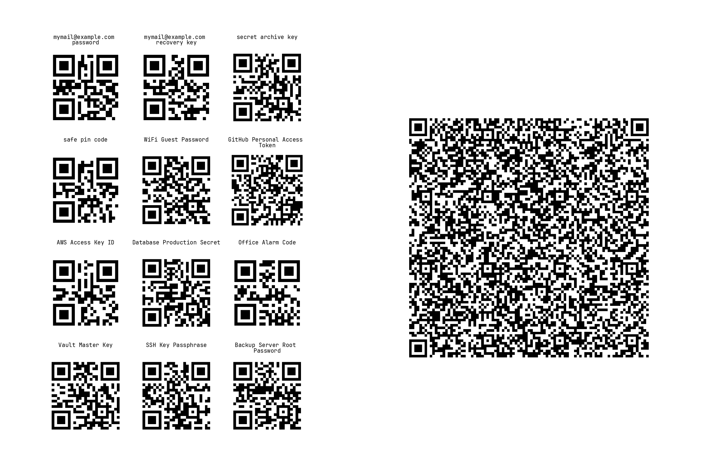

# passqr

Backup your most critical passwords/secrets/credentials in 3 simple steps:

1. Write a [toml](https://toml.io) file containing key-value pairs of your credentials:
    ```toml
    "mymail@example.com password" = "mymailpassword"
    "mymail@example.com recovery key" = "recoverykey"
    "secret archive key" = "keyfromsecretarchive"
    "safe pin code" = "12345678"
    ```
2. Run `passqr credentials.toml`.
3. Print (preferrably double-sided) `output.pdf` file.

Resulting printout contains pairs of pages.



Odd pages contains qr codes of individual values with key as label. Even page contains qr code with full toml of all individual entries from previous page. You can use individual qrcodes from odd pages if you need a single secret in a pinch, or use large qrcodes from even pages to recover entire `credentials.toml` file if you loose it.

> [!IMPORTANT]  
> Always check resulting pdf and printout.
> Try scanning all codes and validate that they can be decoded.
> For larger values qr codes can become quite intricate and printing defects may make them unrecoverable.
